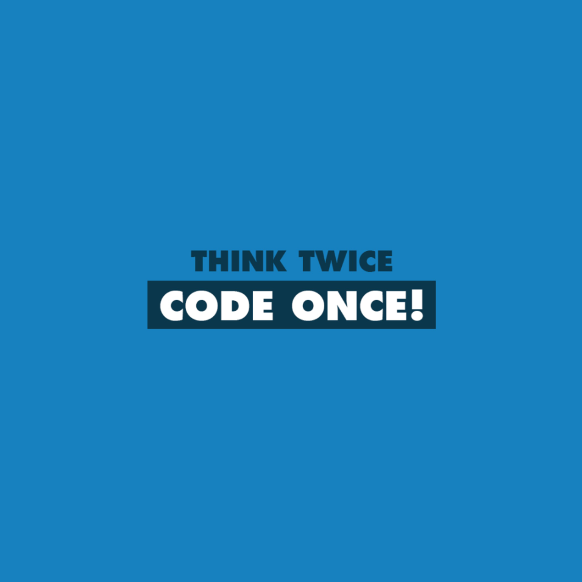

## Are Coding Standards Helpful?

I find that students often view coding standards as a pain in the ass.  They seem like they slow the learning process of learning new programming languages.  They sometimes feel restricting and in the way of the material.  However, I have found that coding standards actually  do the opposite.  They often make the process of learning a new programming language easier and more efficient.  They not only make the code clear and readable, but can also act as a visual representation of a certain concept with whatever programming language they belong to.  

### ESLint and Intellij

After the first week of using ESLint and Intellij, I have not had much of a problem receiving that wonderful green check mark in the top right corner.  In fact, I find it very satisfying knowing my code meets the coding standards we are working with.  I find it easier to read and understand exactly what my code is doing.  It helps keep my code from becoming too messy and disordered.  As satisfying as it is to get the glorious green check mark, nothing is more frustrating and infuriating as having that horrible red dot tell you something is wrong nd you can't figure out what.  I have spent hours looking at a piece of code only to realize I was missing a semi colon.  But after learning from those mistakes, I have become a stronger programmer.  I find that I learn language far more quickly than when I started and I believe coding standards were a massive help with that.  

 