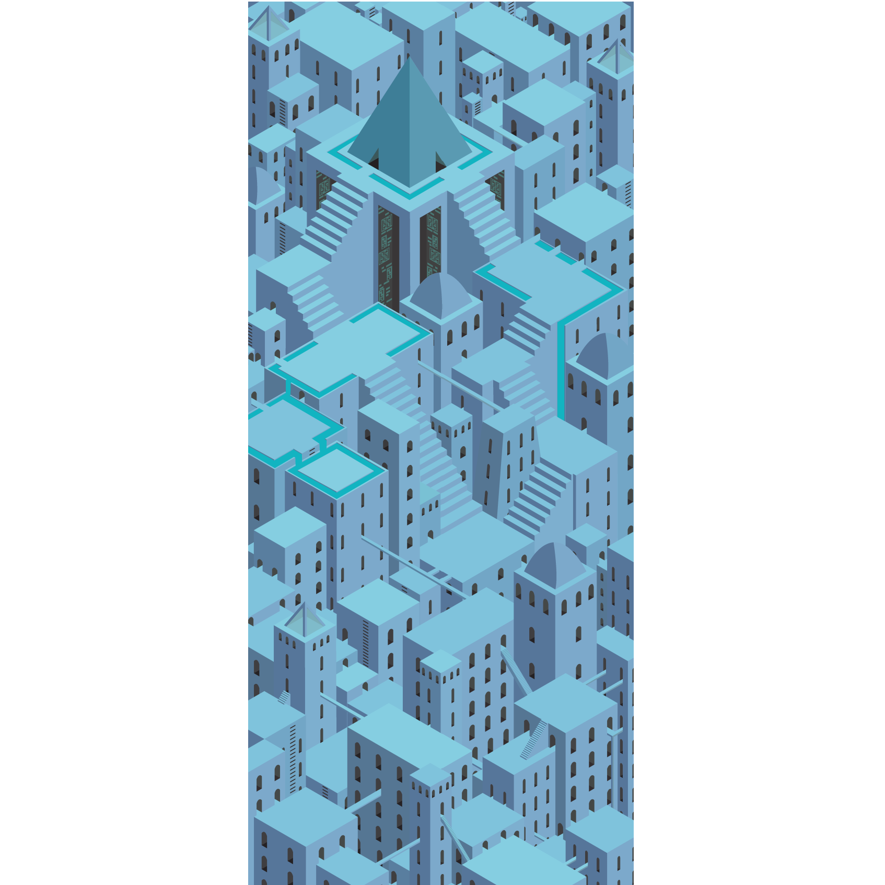

  

One of my favorite projects I have worked on in the past couple of years was my Digital Media class final.  For the project we had to create a 16 in X 39 in illustration print of a cityscape in Isometric perspective.  Isometric perspective is a visual perspective in which any two of the three coordinate axis have a 120 degree angle.  This creates a 2D representation of 3D objects that looks similar to pixel art.  The best part about the project was learning and mastering the process of taking a concept and turning it into a finished product.

For this project I decided to push my Adobe Illustrator skills at the time to produce something I would want to possibly include in a portfolio.  Since I wanted to challenge myself, the project became very time consuming.  My idea changed multiple times and that can be very frustrating.  The entire process overall taught me to be patient with myself and my abilities as an artist.  I took my time and slowly evolved my piece over the course of the class until I had a wonderful finished product.  

By the end of the project I had piece that I am genuinely proud of.  I took my time to work on details and produce something of worth.  I was also able to improve not only my artistic skills with color and composition, but I also imporved my Adobe Illustrator skills in terms of software use.  

