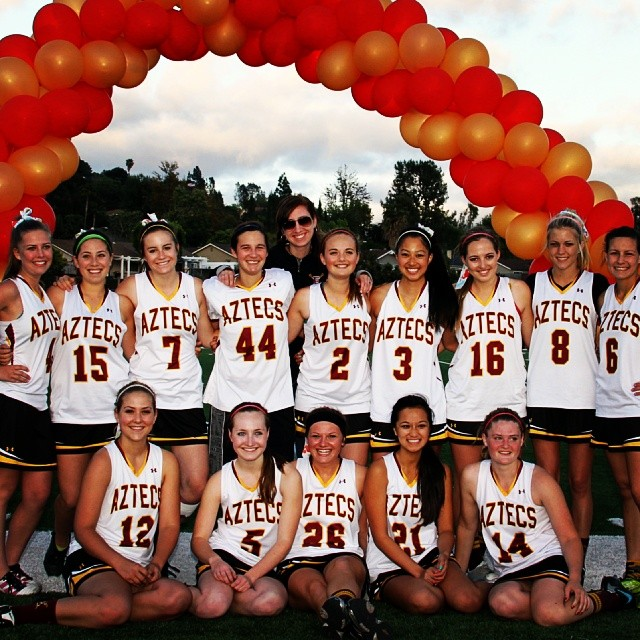

For all four years of high school, I was a captain or co-captain for my women's lacrosse team.  I went from never playing the sport before I attended high school, to growing into a better team leader.  Being a captain for my team molded me into a better athlete, student, and person.  Once I graduated school and was done playing sports, I was able to use my new skills and teach other young lacrosse players how to improve their own skills.  

The biggest thing that being a captain taught me was not only teamwork but patience when working with others.  The more patience I had, the better leader I became.  I learned how to lead my team and inspire my teammates to become the best players they could be.  I found that by being there for my team and motivating them to do better, motivated me to be better.  I was able to help improve my friends skills by improving my own skills.  I was also able to take suggestions from my teammates and work together with them to improve our season record each year.  We were able to bond well and work cohesively as a group to win one of our toughest games.
(for refernce I am wearing jersesy #2)
